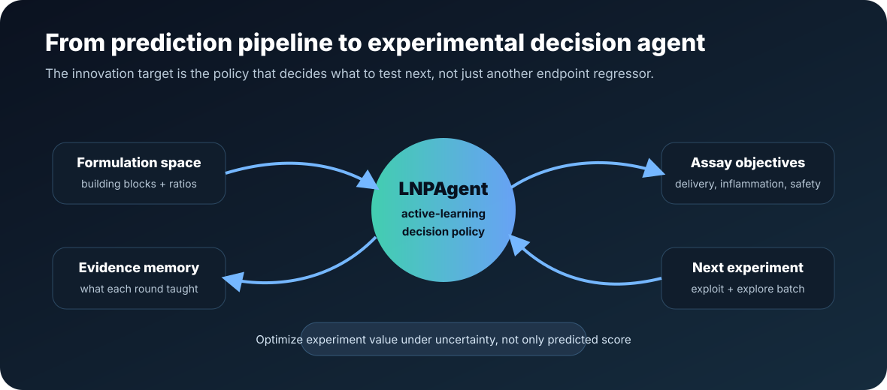
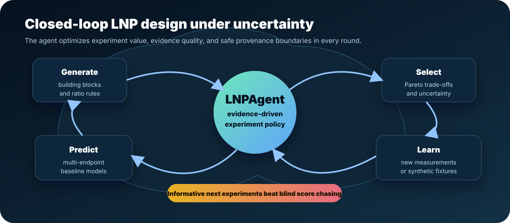
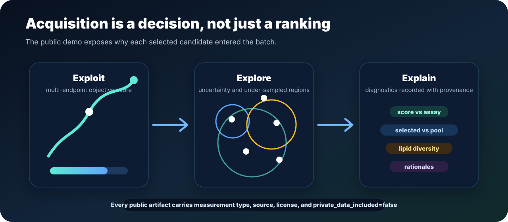
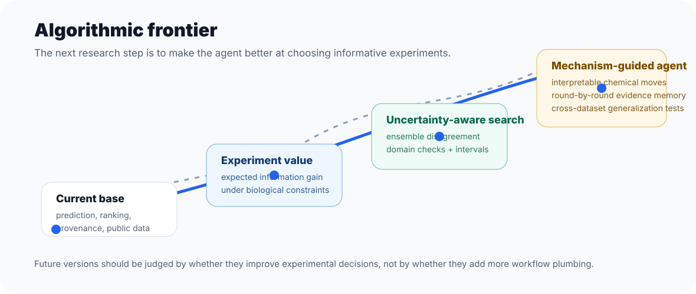
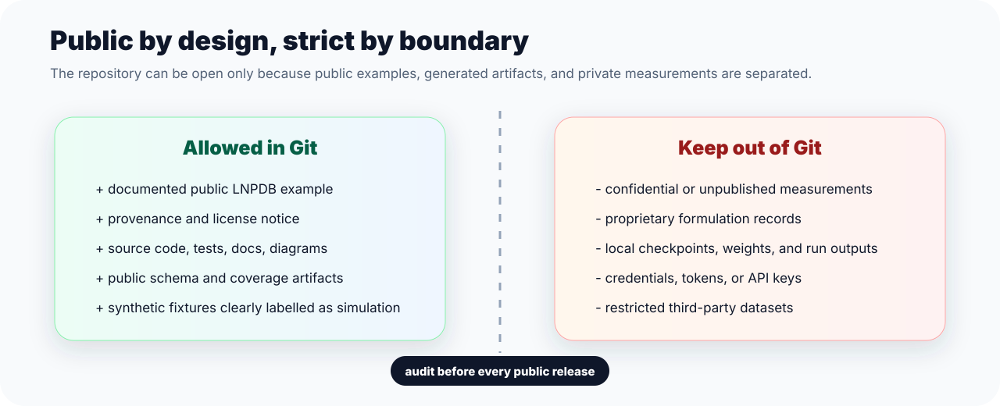
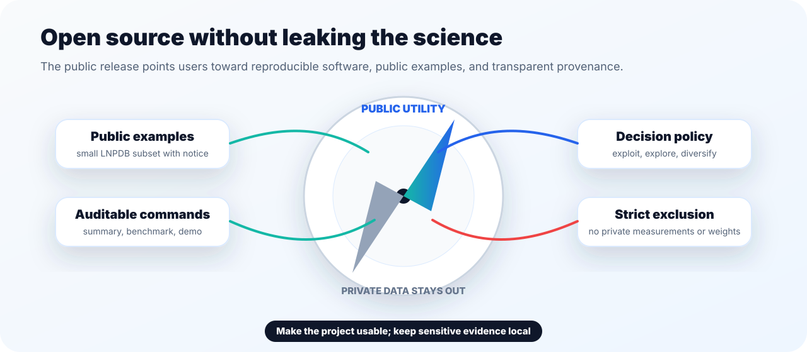

# LNPAgent

> Open-source research software for uncertainty-aware lipid nanoparticle formulation design.

LNPAgent is being built around a simple research idea: an LNP design system should not only predict which candidate looks good today. It should help a scientist decide which experiment is most worth running next, explain why that experiment is informative, and record how new evidence changes the next round.

The public repository is a release-safe foundation for that goal. It includes source code, tests, documentation, diagrams, and a small public LNPDB example. It intentionally excludes confidential measurements, proprietary formulation records, local checkpoints, model weights, and generated private run artifacts.



## What LNPAgent Tries To Solve

Most formulation ML pipelines end at a score: provide a candidate, receive a prediction. LNPAgent treats prediction as one step inside a larger closed-loop design process.

The target loop is:

1. build or import a formulation space;
2. featurize chemistry, ratios, and assay context;
3. predict multiple readouts with uncertainty;
4. select an experiment batch by expected experiment value;
5. inspect Pareto trade-offs, rationale, and provenance;
6. ingest new measurements or public-safe synthetic fixtures;
7. update the next round.



This framing makes the project less like a one-shot endpoint regressor and more like an auditable research agent for LNP design.

## Current Public Capabilities

The current public branch focuses on making the project useful without exposing private LNP data.

- **Public LNPDB adapter:** `lnp-agent --public-summary` summarizes the bundled public LNPDB example without relabelling public assay fields as native LNPAgent endpoints.
- **Public benchmark artifact:** `lnp-agent --benchmark-public` writes reproducible schema and assay-coverage metadata for the public example.
- **One-round public demo:** `lnp-agent --demo-public` builds a public-safe acquisition-policy demo from the LNPDB example.
- **Experiment-value scoring:** candidate selection balances exploitation, uncertainty-driven exploration, and design-space diversity.
- **Acquisition diagnostics:** the public demo reports score/public-assay Spearman, selected-vs-pool public assay mean delta, selected lipid diversity, and rationale counts.
- **Candidate-specific uncertainty proxy:** ranking outputs include per-candidate ensemble dispersion where available.
- **Robust Pareto filtering:** candidates with missing or non-finite objectives are excluded from Pareto-front claims.
- **Public release audit:** `scripts/audit_public_repository.py` rejects tracked private-data paths, run outputs, checkpoints, and disallowed data files.



The public demo is deliberately modest. It demonstrates software mechanics and provenance. It is not a biological efficacy benchmark, not a clinical claim, and not a recommendation to synthesize or test any specific formulation.

## Latest Research Direction

Recent internal research iterations moved the broader project toward a more complete closed-loop active-learning agent:

- 3-round SOP-style active-learning runs with generation, prediction, filtering, reporting, synthetic measurement, and retraining.
- stronger path handling and state controls so local LLM tool calls do not derail the workflow with wrong file names;
- anti-redundancy logic to reduce repeated tool calls during filtering and reporting;
- high-capacity predictor experiments using XGBoost and MLP-style model options;
- UCB/EI-style acquisition experiments for more principled exploration-exploitation trade-offs;
- feature-selection and quantile-uncertainty experiments to make interval widths more candidate-specific;
- active-learning trajectory reporting across rounds.

Those internal runs are not committed as public data because they depend on private or local research assets. The public branch extracts the reusable software direction while keeping the data boundary strict.



## Public Data Boundary

LNPAgent is intended to be open source, so the data boundary is non-negotiable.



Allowed public data in this repository is limited to:

- `data/lnpdb_public_example.csv`
- `data/README.md`
- `data/LNPDB_NOTICE.md`

The bundled CSV is a 100-row example from the public, MIT-licensed [LNPDB](https://github.com/evancollins1/LNPDB) project. It is suitable for package validation, schema inspection, and public examples. It is not a native LNPAgent training set and not a performance benchmark.

Do not commit:

- confidential or unpublished LNP measurements;
- proprietary formulation records;
- local wet-lab outputs or generated artifacts;
- model weights, checkpoints, or caches;
- API keys, tokens, credentials, or private configuration;
- restricted third-party datasets without explicit redistribution rights.



Before pushing public changes, run:

```bash
python scripts/audit_public_repository.py
```

## Quick Start

LNPAgent requires Python 3.10 or newer. RDKit is easiest to install through conda-forge; the remaining package dependencies can then be installed with pip.

```bash
git clone https://github.com/longbaobaozhuiwen/LNPAgent.git
cd LNPAgent
conda create -n lnpagent -c conda-forge python=3.11 rdkit
conda activate lnpagent
python -m pip install -e '.[dev]'
lnp-agent --check-data
pytest
```

Optional GPU, AGILE, and local LLM integrations are supported by configuration but are not bundled with weights, checkpoints, or credentials:

```bash
python -m pip install -e '.[gpu,llm,agile]'
export LNP_AGENT_AGILE_CHECKPOINT=/path/to/agile_model.pth
export LNP_AGENT_GEMMA_MODEL=/path/to/gemma
```

## Public Commands

```bash
lnp-agent --check-data        # validate the configured CSV
lnp-agent --public-summary    # summarize the public LNPDB example
lnp-agent --benchmark-public  # write artifacts/benchmark_public_lnpdb.json
lnp-agent --demo-public       # write artifacts/public_demo_round.json
```

The public benchmark and demo artifacts include provenance fields such as source dataset, license, package metadata, measurement type, and `private_data_included=false`.

To use your own local data without editing source files:

```bash
export LNP_AGENT_DATA=/path/to/your/formulations.csv
export LNP_AGENT_ARTIFACTS=/path/to/lnpagent-artifacts
lnp-agent --check-data
```

Keep full datasets outside the repository unless redistribution rights, provenance, and audit allowlisting are explicit.

## Repository Map

```text
src/lnp_agent/       agent engine, public data commands, data managers, tools, CLI
src/lnp_core/        feature engineering, model evaluation, ranking, uncertainty
data/                approved public LNPDB example and data-use notices
assets/              README diagrams and project illustrations
docs/                architecture, release policy, and scientific audit
tests/               public-release smoke and regression tests
scripts/             data extraction and public-release audit utilities
```

## Scientific Scope

Current capabilities include:

- formulation-library generation from configurable building blocks;
- molecular and formulation feature construction for deployable baselines;
- multi-objective ranking with Pareto diagnostics;
- candidate-level uncertainty proxy from ensemble dispersion;
- experiment-value batch selection with rationale fields;
- public LNPDB schema validation and coverage summaries;
- public-safe one-round acquisition demo diagnostics;
- synthetic wet-lab simulation for software exercises.

Important limitations:

- The bundled public data is an example, not a native endpoint benchmark.
- Public demo predictions are synthetic software fixtures, not physical measurements.
- Candidate uncertainty is still a proxy and needs calibration before probabilistic claims.
- Generalization across chemistry, cargo, assay platform, species, tissue, or disease context remains an empirical question.
- Any real candidate formulation must be validated experimentally by qualified scientists.

## Roadmap

Near-term work should improve public usability while preserving the private-data boundary:

- **Public data bridge:** add a careful adapter from LNPDB-style public records to public-safe software examples while preserving assay semantics.
- **Runnable public demo loop:** expose a light one-round CLI workflow for generation, ranking, reporting, synthetic measurement, and retraining summary.
- **Calibrated uncertainty:** compare ensemble dispersion, applicability-domain checks, quantile intervals, and conformal intervals against held-out measurements.
- **Mechanism-guided exploration:** prioritize chemistry and ratio perturbations that teach design rules, not only numerical optimization.
- **Evidence memory:** summarize what each round learned, which hypotheses failed, and which design regions became more or less promising.
- **Broader endpoint integration:** support targeting and context metadata when redistribution-safe data is available.

## Contributing

Before opening a pull request, run:

```bash
python scripts/audit_public_repository.py
pytest
```

Contributions are governed by [CONTRIBUTING.md](CONTRIBUTING.md), [SECURITY.md](SECURITY.md), and [docs/PUBLIC_RELEASE_POLICY.md](docs/PUBLIC_RELEASE_POLICY.md). Keep private data, restricted third-party data, generated artifacts, weights, checkpoints, and secrets out of Git.

## License

LNPAgent is released under the [MIT License](LICENSE). Dependencies and external datasets retain their own licenses and terms.

