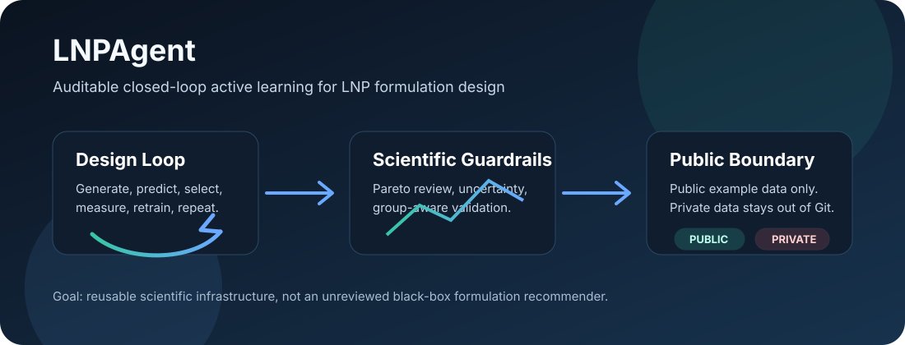
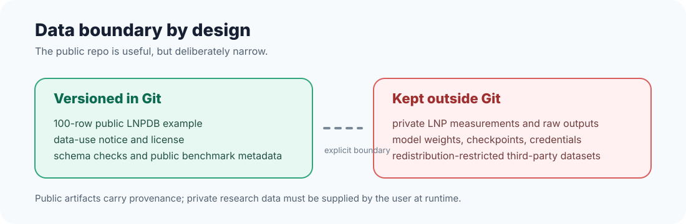
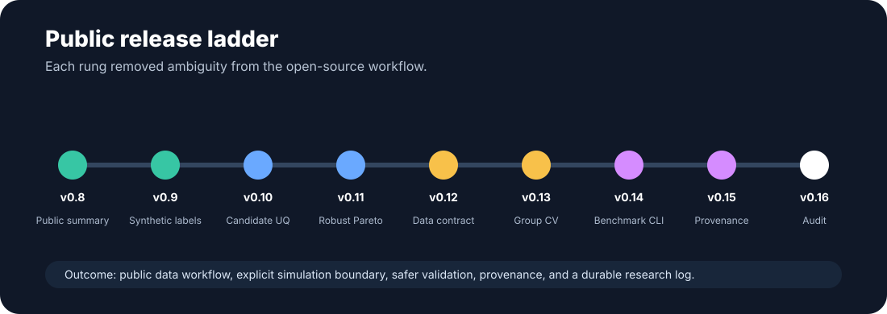

# LNPAgent

> Closed-loop active learning infrastructure for lipid nanoparticle formulation design.

LNPAgent is an open-source research package for making LNP design loops explicit: generate candidate formulations, predict multiple endpoints, select a balanced experimental batch, record measurements or simulations, retrain, and repeat. The project is built around auditability: every public artifact should say what data it used, what produced it, and what scientific claim it does or does not support.



## Why This Exists

LNP formulation design is rarely a single prediction problem. A useful workflow has to balance delivery, inflammation-related signals, uncertainty, assay coverage, and the boundary between software simulations and real measurements. LNPAgent focuses on that full loop rather than presenting a model score as a standalone recommendation.

The current public release is intentionally conservative. It includes a small, MIT-licensed public LNPDB example for software validation, but no private LNP measurements, raw experimental outputs, model weights, AGILE checkpoints, or API credentials.

## Core Design


- **Generate** virtual LNP formulation libraries from configurable building blocks.
- **Predict** transfection and inflammation-related endpoints from formulation and molecular features.
- **Select** exploitation and uncertainty-driven exploration batches.
- **Review** Pareto fronts, chemical-space plots, benchmark artifacts, and provenance.
- **Measure or simulate** candidates through an explicit boundary: synthetic oracle outputs are labelled as simulation, not evidence.
- **Retrain** models and carry forward the versioned research log.

## Public Data Boundary



The versioned `data/lnpdb_public_example.csv` is a 100-row subset of the public, MIT-licensed [LNPDB](https://github.com/evancollins1/LNPDB) dataset. The source revision, upstream checksum, included-file checksum, license, and research-use limits are recorded in [data/LNPDB_NOTICE.md](data/LNPDB_NOTICE.md).

The bundled LNPDB subset is useful for source-local software checks and schema coverage. Its assay values are not relabelled as native LNPAgent endpoints and must not be treated as formulation recommendations, biological efficacy claims, or clinical decision support.

Point LNPAgent to external user-controlled data and artifacts without editing source:

```bash
export LNP_AGENT_DATA=/path/to/your/formulations.csv
export LNP_AGENT_ARTIFACTS=/path/to/lnpagent-artifacts
lnp-agent --check-data
```

## What Changed In The Public Release Cycle



The v0.8.0-v0.16.0 release cycle turned the repository from an internal research snapshot into a safer public project:

- Public LNPDB validation, summary, and reproducible benchmark CLI.
- Explicit synthetic-measurement provenance for the wet-lab oracle.
- Candidate-level ensemble uncertainty instead of a single global uncertainty proxy.
- Pareto ranking that excludes non-finite objectives.
- Native-schema loading without private-grid cardinality assumptions.
- Transfection `log1p` domain validation.
- Template-group-aware inner CV for tuned model configurations.
- Provenance metadata in public benchmark artifacts.
- Versioned research log and scientific/engineering audit.

See [research_log.md](research_log.md) and [docs/SCIENTIFIC_AND_ENGINEERING_AUDIT.md](docs/SCIENTIFIC_AND_ENGINEERING_AUDIT.md) for the full audit trail.

## Quick Start

LNPAgent requires Python 3.10 or newer. RDKit is easiest to install through conda-forge; other dependencies can then be installed with pip.

```bash
git clone https://github.com/longbaobaozhuiwen/LNPAgent.git
cd LNPAgent
conda create -n lnpagent -c conda-forge python=3.11 rdkit
conda activate lnpagent
python -m pip install -e '.[dev]'
lnp-agent --check-data
pytest
```

Optional GPU, AGILE, and local LLM integrations are not bundled with weights or credentials:

```bash
python -m pip install -e '.[gpu,llm,agile]'
export LNP_AGENT_AGILE_CHECKPOINT=/path/to/agile_model.pth
export LNP_AGENT_GEMMA_MODEL=/path/to/gemma
```

## Public Benchmark Commands

Validate whichever CSV is configured by `LNP_AGENT_DATA`:

```bash
lnp-agent --check-data
```

Inspect the bundled public example without endpoint relabelling:

```bash
lnp-agent --public-summary
```

Write a reproducible public benchmark artifact with provenance:

```bash
lnp-agent --benchmark-public
```

This writes `artifacts/benchmark_public_lnpdb.json`. It is a schema and assay coverage benchmark only. The JSON includes a `provenance` block with generator, package version, artifact schema, source dataset/license, and `private_data_included=false`.

## Repository Map

```text
src/lnp_agent/       agent engine, data managers, tools, and CLI
src/lnp_core/        feature engineering, model evaluation, ranking, uncertainty
data/                public LNPDB example and data-use policy
assets/              README diagrams and workflow illustrations
docs/                architecture and public scientific/engineering audit
tests/               release-level smoke and regression tests
```

Further design detail is in [docs/ARCHITECTURE.md](docs/ARCHITECTURE.md).

## Reproducibility And Safety

LNPAgent is research software. Its behavior depends on data selection, simulator choice, feature construction, random seeds, model configuration, and hardware. Validate all candidate formulations experimentally. Do not use LNPAgent for clinical decision-making.

The bundled wet-lab tool is a deterministic, noisy synthetic oracle for software exercises. Its outputs are labelled `measurement_type=synthetic_oracle` and are not experimental evidence.

## Development

```bash
python -m pip install -e '.[dev]'
pytest
ruff check src tests
```

Contributions are governed by [CONTRIBUTING.md](CONTRIBUTING.md). Please do not commit confidential data, raw experimental outputs, redistribution-restricted third-party datasets, model weights, checkpoints, API keys, or other secrets.

## License

LNPAgent is released under the [MIT License](LICENSE). Dependencies and external datasets retain their own licenses and terms.

