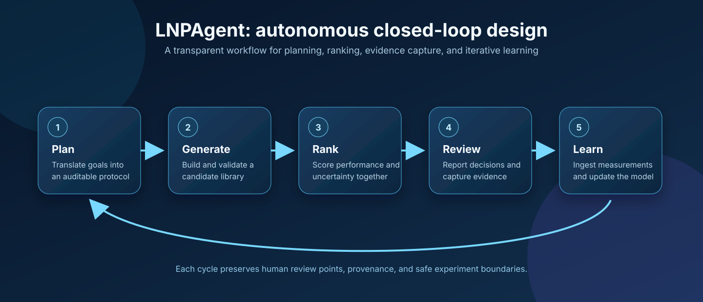

# LNPAgent

> Closed-loop active learning for lipid nanoparticle (LNP) formulation design.

LNPAgent is a research software package for iterating from a virtual LNP
library to model predictions, candidate selection, experimental measurements,
and retraining. It is designed to make the sequence explicit and auditable,
rather than presenting a single model prediction as a complete design process.



## What it does

- Generates virtual formulation libraries from configurable building blocks.
- Predicts transfection and inflammation-related endpoints from formulation and
  molecular features.
- Selects complementary exploitation and uncertainty-driven exploration batches.
- Coordinates a multi-round workflow with reporting, measurement, and retraining states.
- Produces Pareto and chemical-space diagnostics for candidate review.

The diagram shows the intended software architecture, not experimental results
or a performance claim. Every loop is designed to preserve review points,
provenance, and appropriate experimental boundaries.

## Quick start

LNPAgent requires Python 3.10 or newer. RDKit is easiest to install through
conda-forge; other dependencies can then be installed with pip.

```bash
git clone https://github.com/longbaobaozhuiwen/LNPAgent.git
cd LNPAgent
conda create -n lnpagent -c conda-forge python=3.11 rdkit
conda activate lnpagent
python -m pip install -e '.[dev]'
lnp-agent --check-data
pytest
```

For the optional GPU XGBoost path and local Gemma integration:

```bash
python -m pip install -e '.[gpu,llm]'
```

No model weights, API credentials, or AGILE checkpoints are bundled. Configure
their local locations with `LNP_AGENT_GEMMA_MODEL` and
`LNP_AGENT_AGILE_CHECKPOINT` when using those optional components.

## Data and artifacts

The versioned `data/lnpdb_public_example.csv` is a 100-row subset of the
public, MIT-licensed [LNPDB](https://github.com/evancollins1/LNPDB) dataset.
The source revision, upstream checksum, included-file checksum, license, and
research-use limits are recorded in [data/LNPDB_NOTICE.md](data/LNPDB_NOTICE.md).
Larger source datasets, checkpoints, raw experimental results, and third-party
repository snapshots are intentionally excluded from Git.

Point to an external dataset and artifacts directory without editing source:

```bash
export LNP_AGENT_DATA=/path/to/your/formulations.csv
export LNP_AGENT_ARTIFACTS=/path/to/lnpagent-artifacts
lnp-agent --check-data
```

`lnp-agent --check-data` detects either the public LNPDB schema or the native
LNPAgent research schema. The bundled LNPDB subset is useful only for
source-local software exercises: its assay values are not comparable across
unrelated experiments, and it does not support standalone formulation
recommendations.

## Workflow

```text
Generate library -> Predict endpoints -> Select exploitation + exploration
       -> Report diagnostics -> Measure candidates -> Retrain -> Repeat
```

The implementation is organized as follows:

```text
src/lnp_agent/       agent engine, data managers, tools, and visualizations
src/lnp_core/   bundled feature engineering and model evaluation primitives
data/                small public example and data-use policy
assets/              README workflow illustration
docs/                architecture notes
tests/               release-level smoke tests
```

Further design detail is in [docs/ARCHITECTURE.md](docs/ARCHITECTURE.md).

## Reproducibility notes

The workflow is research software. Its behavior depends on the selected data,
simulator, features, random seeds, and hardware. Validate all candidate
formulations experimentally and do not use it for clinical decision-making.

## Development

```bash
python -m pip install -e '.[dev]'
pytest
ruff check src tests
```

Contributions are governed by [CONTRIBUTING.md](CONTRIBUTING.md). Please do
not commit data that cannot legally be redistributed, model weights, or secrets.

## License

LNPAgent is released under the [MIT License](LICENSE). Dependencies and any
external datasets retain their own licenses and terms.
